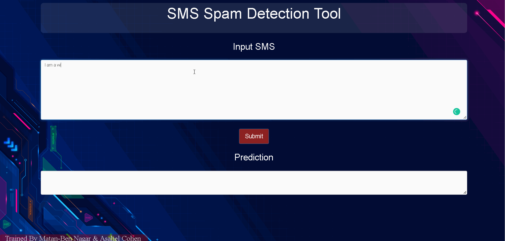

# Spam Detection Web Tool

Spam SMS Detection Project implemented using NLP & Transformers. roBerta - a hugging face Transformer model for text classification is used to fine-tune to best suit data to achieve the best results. The model was deployed on the Flask server.

# Demo



## Description

Training SimpleTransformers model on [SMS Spam Collection Dataset](https://www.kaggle.com/datasets/uciml/sms-spam-collection-dataset), resulting in 0.9993 accuracy on the test results. 

## Getting Started

### Dependencies

* Please refer to .[The pyTorch website](https://pytorch.org/get-started/locally/) to install PyTorch
* Make the appropriate adjustments to enable Cuda on your PC for faster experience 
* Python 3.8.6
* transformers 4.17.0
* torch 1.9.0

### Installing

* git clone this repository
* Create a virtual environment using 
```
Python -m venv .
```
* run 
```
pip install -r /path/to/requirements.txt
```
* download [The Trained Model](https://drive.google.com/file/d/1mI19Mb4IQC4ScndHirmGIKyn6EXI9Swu/view?usp=sharing) and extract to the root repository

### Executing program

#### CMD:
* Inside the folder load CMD
* run 
```
python application.py
```
#### PyCharm
* load the projects folder and press Run.
* The website will automatically load.
* Insert your messages and press Predict.

## Training the model yourself

* Download the "train_model" folder onto your PC
* Follow the installations command to set up the environment 
* Execute
```
python training.py
```
* At the end of the training, 'outputs' folder will be created. This is your trained model.


## Contributors

<!-- ALL-CONTRIBUTORS-LIST:START - Do not remove or modify this section -->
<!-- prettier-ignore-start -->
<!-- markdownlint-disable -->
<table>
  <tr>
    <td align="center"><a href="https://github.com/asahelcohen/"><br /><sub><b>Asahel Cohen</b></sub></a><br /> </td>
  </tr>
</table>
